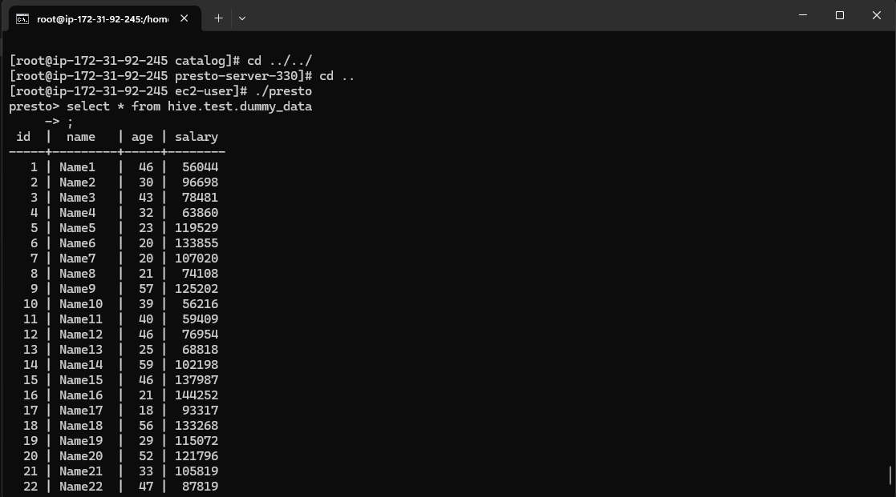

#### PrestoDB
 
 Following the instructions below to setup PrestoDB on an Amazon EC2 instance in your account. ***If you already have access to a PrestoDB instance then you can skip this section but keep its connection details handy (see the `presto` section in the [`config`](./config.yml) file)***.

1. Create a security group to limit access to Presto. Create a security group called **MyPrestoSG** with two inbound rules to only allow access to Presto.
    - Create the first rule to allow TCP inbound traffic on port 8080, 22, 443, 80, 3306 to Anywhere-IPv4
    - Create the second rule rule to allow allow inbound traffic on port 22 to your IP only.
    - You should allow all outbound traffic

1. Spin-up an EC2 instance with the following settings. This instance is used to run PrestoDB.
    - AMI: Deep Learning OSS Nvidia Driver AMI GPU PyTorch 2.3.0 (Amazon Linux 2) 20240806
    - SSD Volume Type – GPIO 3
    - Instance type: `t3a.medium`
    - Subnet: Pick a public one and assign a public IP
    - IAM role: LabRole
    - EBS: 65 GB gp2
    - Security group: MyPrestoSG


# Install Mariadb-server

```{.bash}

sudo su root

```

### We use a standalone version of the Hive metastore which runs without the rest of Hive. Hive metastore requires a database to store the schemas. For this, you can use DerbyDB, MySQL, MariaDB, and PostgreSQL. You will see how to use it with MariaDB.

```{.bash}

yum install mariadb-server -y
sudo systemctl enable mariadb.service
sudo systemctl start mariadb.service
```

```{.bash}
#Check Status If required

systemctl status mariadb.service
```

Next, you will need to create a user and a database for the Hive metastore, which you can do with the following command:

```{.bashrc}

sudo mysql -u root -e "
    DROP DATABASE IF EXISTS metastore;
    CREATE DATABASE metastore;

    CREATE USER 'hive'@localhost IDENTIFIED BY 'hive';
    GRANT ALL PRIVILEGES ON *.* TO 'hive'@'localhost';
    FLUSH PRIVILEGES;"

```

### Great, now that the database is set up, we can continue with downloading and extracting the metastore to `/usr/local/metastore` with
```{.bashrc}
wget "https://repo1.maven.org/maven2/org/apache/hive/hive-standalone-metastore/3.1.2/hive-standalone-metastore-3.1.2-bin.tar.gz"
tar -zxvf hive-standalone-metastore-3.1.2-bin.tar.gz
sudo mv apache-hive-metastore-3.1.2-bin /usr/local/metastore
sudo chown ec2-user:ec2-user /usr/local/metastore

```

### Hive metastore requires some dependencies from Hadoop, therefore you need to download Hadoop as well with:

```{.bashrc}

wget "https://downloads.apache.org/hadoop/common/hadoop-3.2.4/hadoop-3.2.4.tar.gz"
tar xvf hadoop-3.2.4.tar.gz
sudo mv hadoop-3.2.4 /usr/local/hadoop
sudo chown ec2-user:ec2-user /usr/local/hadoop
```

There are a few dependencies that you need to copy and change to make it compatible with S3 and Hadoop. Here are the commands for that:
```{.bashrc}
rm /usr/local/metastore/lib/guava-19.0.jar
cp /usr/local/hadoop/share/hadoop/common/lib/guava-27.0-jre.jar \
  /usr/local/metastore/lib/
cp /usr/local/hadoop/share/hadoop/tools/lib/hadoop-aws-3.2.4.jar \
  /usr/local/metastore/lib/
cp /usr/local/hadoop/share/hadoop/tools/lib/aws-java-sdk-bundle-1.11.901.jar \
  /usr/local/metastore/lib/

```

Great!, now lets install JDBC Drivers for Hive server

```{.bashrc}
wget http://www.java2s.com/Code/JarDownload/mysql/mysql-connector-java-commercial-5.1.7-bin.jar.zip
unzip mysql-connector-java-commercial-5.1.7-bin.jar.zip 
mysql-connector-java-commercial-5.1.7-bin.jar  /usr/local/metastore/lib/

```

## Configuration
Now, Hive needs connection details to your S3 bucket. This can be done in the `/usr/local/metastore/conf/metastore-site.xml` file. Open the existing metastore-site.xml and add the following properties within the <configuration> section:

**This is present in the current repository and is named metastore-site.xml, just replace the contents over to this file**

Additionally, you will need to define the `JAVA_HOME` and `HADOOP_HOME` environment variables. This instance comes with java preinstalled. To find your path, you can use the following command

```{.bashrc}
readlink -f $(which java)

```

Mostly, the path defaults to:

```{.bashrc}
export JAVA_HOME=/usr/lib/jvm/java-11-amazon-corretto.x86_64
export HADOOP_HOME=/usr/local/hadoop

```

To have those ready every time you open the shell, you need to append those two lines in the `~/.bashrc file`. Once you have everything configured, you can initialize the metastore with:

```{.bashrc}

/usr/local/metastore/bin/schematool -initSchema -dbType mysql

```

After the initialization is finished, you can start the metastore service with: (One time only, repeat only whenever the instance is restarted)

```{.bashrc}

/usr/local/metastore/bin/start-metastore &

```

## Install presto Server
```{.bash}
wget https://repo1.maven.org/maven2/io/prestosql/presto-server/330/presto-server-330.tar.gz
sudo tar -xvzf presto-server-330.tar.gz -C /opt/

```

## install presto CLI
Additionally, you will need the CLI in order to access the query engine, which you can download to the bin folder of the same directory and make it executable:

```{.bashrc}
# https://prestodb.io/docs/current/installation/cli.html
wget https://repo1.maven.org/maven2/com/facebook/presto/presto-cli/0.288/presto-cli-0.288-executable.jar
mv  presto-cli-0.286-executable.jar presto-server-330/bin/presto
chmod +x presto
```

## Navigate to Presto

```{.bash}
cd /opt/presto-server-330
```

## Create config Directory

1. Configure Presto and add a data source. Before we start the Presto daemon, we must first provide a set of configuration files in `presto-server-330/etc` and add a data source. Go into presto-server-330 and create the `etc` directory

    ```{.bash}
    cd presto-server-330
    mkdir etc
    ```

    - Then create the three files using vim or your favorite text editor.
        - Presto logging configuration file `etc/config.properties`

            ```{.bash}
            coordinator=true
            node-scheduler.include-coordinator=true
            http-server.http.port=8080
            query.max-memory=5GB
            query.max-memory-per-node=1GB
            query.max-total-memory-per-node=2GB
            discovery-server.enabled=true
            discovery.uri=http://localhost:8080 
            ```

        - Presto node configuration: `etc/node.properties`

            ```{.bash}
            node.environment=production
            node.id=ffffffff-ffff-ffff-ffff-ffffffffffff
            node.data-dir=/usr/local/presto/data 
            ```

        - JVM configuration: `etc/jvm.config`
        
            ```{.bash}
            -server
            -Xmx4G
            -XX:+UseG1GC
            -XX:G1HeapRegionSize=32M
            -XX:+UseGCOverheadLimit
            -XX:+ExplicitGCInvokesConcurrent
            -XX:+HeapDumpOnOutOfMemoryError
            -XX:+ExitOnOutOfMemoryError
            -Djdk.nio.maxCachedBufferSize=2000000
            -Djdk.attach.allowAttachSelf=true 
            ```
### Finally, you need to configure the connection to S3. For this create the file `/usr/local/trino/etc/catalog/hive.properties` with the following contents:        

```{.bash}

connector.name=hive-hadoop2
hive.metastore.uri=thrift://localhost:9083
hive.s3.use-instance-credentials=true
hive.s3.path-style-access=true
hive.s3.ssl.enabled=false
hive.s3.endpoint=s3.us-east-1.amazonaws.com

```

This should do the trick. Now, you should be able to start Trino by running:

```{.bash}

/usr/local/trino/bin/launcher start

```

Once it is running, you should open the Trino web UI at `{ec2-public-dns}:8080` with the port previously defined in `config.properties`. Once you run queries, they should be listed there.

# Query Data stored on S3:

We will work with a previously uploaded parquet file, which contains dummy data generated.

## Open presto cli

```{.bash}

./bin/presto

```

First, you need to create a schema to access the file which you can do by running the following SQL statement:

```{.bashrc}
CREATE SCHEMA IF NOT EXISTS hive.test WITH (location = 's3a://bigdatateaching1/');
```
Next, you need to create a table to the existing data set on S3 with:

```{.bashrc}
CREATE TABLE IF NOT EXISTS hive.test.dummy_data (
    id INTEGER,
    name VARCHAR,
    age INTEGER,
    salary INTEGER
)
WITH (
    format = 'PARQUET',
    external_location = 's3a://bigdatateaching1/test-parquet/'
);
```
Now, you should be able to query the data with:

```{.bashrc}
select * from hive.test.dummy_data
```
If the query succedds, you should be able to see 
